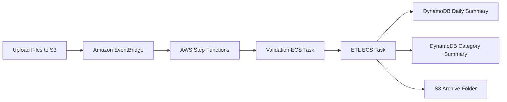

# Event-Driven Data Processing Pipeline using Amazon ECS, AWS Step Functions, EventBridge, DynamoDB, and Amazon S3

## Project Overview

This project demonstrates how to build a fully automated, event-driven data processing pipeline on AWS.

The solution processes e-commerce datasets uploaded to Amazon S3 using containerized Python applications running on Amazon ECS Fargate. The workflow is orchestrated using AWS Step Functions and automatically triggered through Amazon EventBridge whenever new files arrive in the S3 bucket.

The pipeline performs:

1. Data Validation
2. Data Transformation and Aggregation (ETL)
3. Metrics Storage in DynamoDB
4. File Archival in Amazon S3
5. Automated Workflow Orchestration

---

# Business Scenario

An e-commerce company receives transactional files daily from various sources.

The company needs an automated solution to:

* Validate incoming datasets
* Process order data
* Generate daily business metrics
* Store aggregated results
* Archive processed files
* Eliminate manual intervention

This project implements a serverless and event-driven architecture to achieve these goals.

---

# Architecture



---

# AWS Services Used

| Service                | Purpose                                           |
| ---------------------- | ------------------------------------------------- |
| Amazon S3              | Store input and archived datasets                 |
| Amazon ECR             | Store Docker container images                     |
| Amazon ECS Fargate     | Run containerized validation and ETL applications |
| AWS Step Functions     | Orchestrate workflow execution                    |
| Amazon EventBridge     | Trigger workflow automatically                    |
| Amazon DynamoDB        | Store processed business metrics                  |
| AWS IAM                | Manage permissions                                |
| Amazon CloudWatch Logs | Monitor task execution                            |

---

# Dataset Used

The pipeline processes the following datasets:

* orders.csv
* order_items.csv
* products.csv

These files are uploaded to:

```text
s3://<bucket-name>/e-commerce-data/new/
```

---

# What We Are Building

We are building a two-stage data processing pipeline.

## Stage 1 - Data Validation

The validation application:

* Reads input files from Amazon S3
* Validates data quality
* Checks file integrity
* Verifies required records exist
* Moves validated files to the next processing stage

Runs as:

```text
Amazon ECS Fargate Task
```

---

## Stage 2 - ETL Processing

The ETL application:

* Reads validated datasets
* Joins order data
* Calculates business metrics
* Generates daily summaries
* Generates category-wise summaries
* Stores results in DynamoDB
* Archives processed files

Runs as:

```text
Amazon ECS Fargate Task
```

---

# End-to-End Workflow

## Step 1 - Upload Files

Users upload:

* orders.csv
* order_items.csv
* products.csv

to the S3 input folder.

---

## Step 2 - Event Detection

Amazon EventBridge continuously monitors S3 events.

When the trigger file is uploaded:

```text
order_items.csv
```

EventBridge automatically starts the workflow.

---

## Step 3 - Workflow Starts

AWS Step Functions receives the event and starts execution.

---

## Step 4 - Validation Task

Step Functions launches:

```text
task-data-validation
```

on Amazon ECS Fargate.

The application:

* Reads files
* Performs validation
* Sends success/failure status

---

## Step 5 - ETL Task

If validation succeeds:

Step Functions launches:

```text
task-etl-calculations
```

on ECS Fargate.

The ETL container:

* Reads datasets
* Performs transformations
* Calculates summaries
* Loads results into DynamoDB

---

## Step 6 - Store Metrics

The ETL application stores data in:

### category-wise-summary

Partition Key:

```text
order_date
```

### daily-order-summary

Partition Key:

```text
order_date
```

---

## Step 7 - Archive Files

After successful processing:

Files are moved to archive locations inside S3.

---

## Step 8 - Workflow Completion

Step Functions marks the execution as successful.

The complete processing pipeline finishes automatically.

---

# ECS Components

## ECS Cluster

```text
ecommerce-data-ingestion-cluster
```

Deployment Type:

```text
AWS Fargate
```

---

## Validation Task

```text
task-data-validation
```

Purpose:

* Data quality validation
* File movement

---

## ETL Task

```text
task-etl-calculations
```

Purpose:

* Data transformation
* Business aggregation
* DynamoDB loading

---

# DynamoDB Tables

## category-wise-summary

Stores:

* Sales by category
* Category metrics
* Aggregated business KPIs

---

## daily-order-summary

Stores:

* Daily sales
* Daily order count
* Daily revenue metrics

---

# Key Learning Objectives

After completing this project, you will understand:

* Event-driven architectures
* Containerized workloads using ECS Fargate
* Docker image lifecycle with ECR
* Workflow orchestration using Step Functions
* EventBridge integrations
* DynamoDB data loading
* Automated data pipelines
* Serverless orchestration patterns
* AWS IAM role management

---

# Real-World Use Cases

This architecture can be used for:

* Retail order processing
* Sales reporting pipelines
* Financial transaction processing
* Log processing systems
* IoT event processing
* Supply chain analytics
* Data lake ingestion workflows

---

# Expected Outcome

At the end of the project:

✅ Docker images stored in ECR

✅ Validation application running on ECS

✅ ETL application running on ECS

✅ Step Functions orchestrating workflow

✅ EventBridge automatically triggering execution

✅ Processed data stored in DynamoDB

✅ Files archived in S3

✅ Fully automated event-driven data processing pipeline
